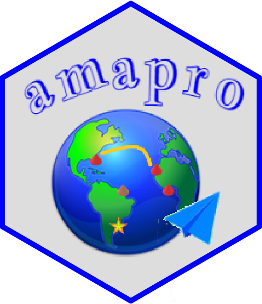
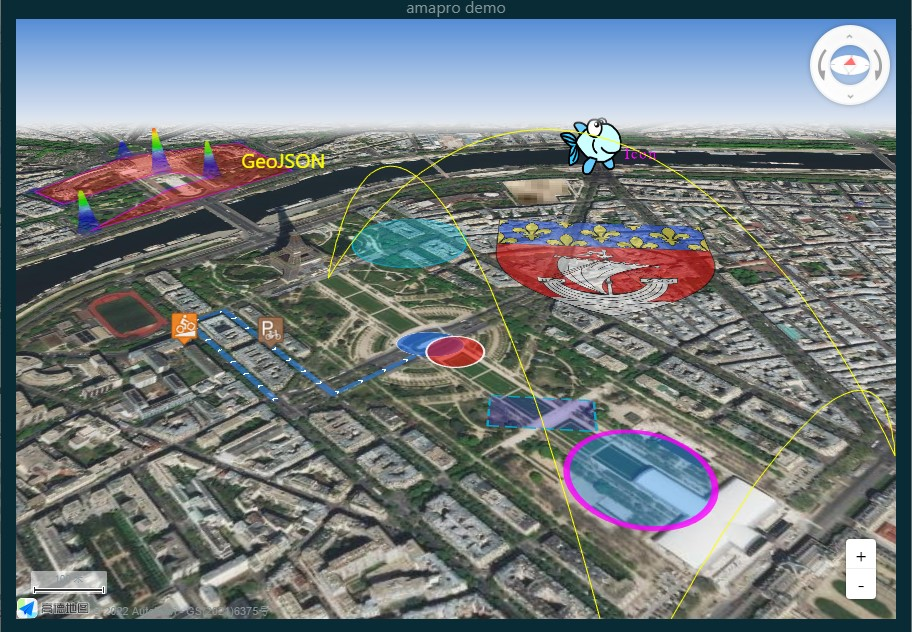

#  amapro &nbsp; &nbsp; &nbsp; &nbsp; [](https://github.com/helgasoft/amapro/releases/)

<!-- badges: start -->
<!--
[](https://github.com/helgasoft/amapro/actions)
[](https://coveralls.io/r/helgasoft/echarty?branch=main)
[](https://helgasoft.github.io/amapro)
-->
<!-- badges: end -->
<!--
<a href='https://helgasoft.github.io/amapro'></a>
-->
A thin R wrapper around Javascript library
[AMap](https://lbs.amap.com/demo/list/jsapi-v2).<br> Uses AMap (and Loca) v.2.0 native commands and parameters, with 
just a few additional commands. Features easy transition 2D to/from 3D, variety of markers and layers, geoJson import, map drawing, dynamic 3D effects like flyover and trace animation, and more. <br/>
Enjoy rich interactive maps in R and Shiny with minimal overhead!


## Installation
<!--
[](https://github.com/helgasoft/amapro/releases) -->
Use latest development version for optimal experience:

``` r
if (!requireNamespace('remotes')) install.packages('remotes')
remotes::install_github('helgasoft/amapro')
```
<!--
[](https://cran.r-project.org/package=amapro) 
From [CRAN](https://CRAN.R-project.org):

``` r
install.packages('amapro')
```
-->

## Examples

#### Minimal
``` library(amapro); am.init() ```

#### Extended
``` r
ctr <- c(22.430151, 37.073011)
turl <- paste0('http://server.arcgisonline.com/ArcGIS/rest/services/',
                 'World_Imagery/MapServer/tile/[z]/[y]/[x]')
helmet <- 'https://upload.wikimedia.org/wikipedia/commons/9/9d/Ancient_Greek_helmet.png'

library(amapro)
am.init(viewMode= '3D', center= ctr, zoom= 10, pitch= 60) |>
am.control(ctype= 'ControlBar', position= 'RT') |>
am.item('TileLayer', tileUrl= turl) |>
am.item('Marker', position= ctr, icon= helmet) |>
am.cmd('set', 'InfoWindow', name='iwin', content='This is Sparta') |>
am.cmd('open', 'iwin', 'm$jmap', ctr)   # m$jmap is the map name in JavaScript
# ... then open in browser for best performance

```
<!--
## Get started

The [**WEBSITE**](https://helgasoft.github.io/amapro) has a gallery with code and tutorials.  
<br /> The package has plenty of [**code
examples**](https://github.com/helgasoft/amapro/blob/main/R/examples.R)
included. Type
**?ec.examples** in the RStudio Console, then copy/paste any code from Help to
see the result.  

Now you can start building beautiful maps with R and Shiny!
-->
## Demo

Run with command ``` demo(am.shiny, 'amapro') ```. Demo will open in default **browser**.

<br />
<p align="center">
<!--<a href='https://helgasoft.github.io/amapro/gallery.html' target='_blank'>-->

<br />Made with amapro. Powered by AMap.
</p>
