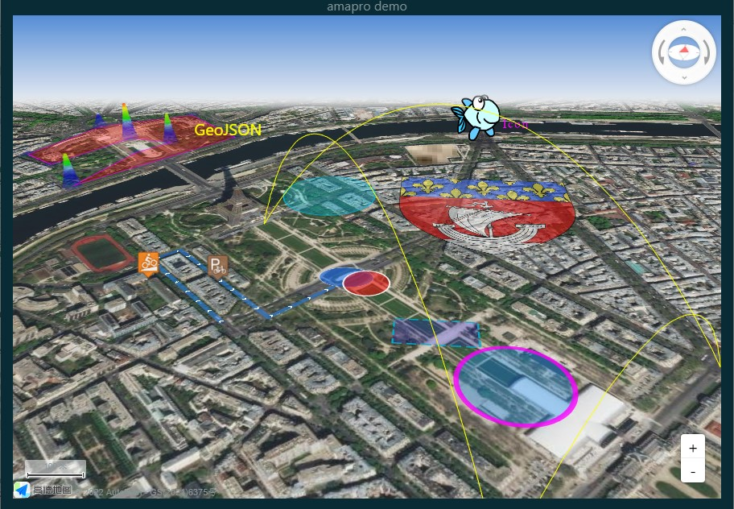

# amapro        

A thin R wrapper around Javascript library
[AMap](https://lbs.amap.com/demo/list/jsapi-v2) and its 3D plugin
[Loca](https://lbs.amap.com/demo/loca-v2/demos/).  
API has eight(8) commands to enclose all AMap and Loca v.2.0 native
commands and parameters.  
Features easy transition 2D to/from 3D, variety of markers and layers,
geoJson import, map manual drawing, dynamic 3D effects like flyover and
trace animation, and more.  
Enjoy rich interactive maps in R and Shiny with minimal overhead!

## Installation

Use latest development version for optimal experience:

``` r
if (!requireNamespace('remotes')) install.packages('remotes')
remotes::install_github('helgasoft/amapro')
```

## Examples

#### Minimal

``` r
library(amapro); am.init()
```

#### Extended

``` r
ctr <- c(22.430151, 37.073011)
turl <- paste0('http://server.arcgisonline.com/ArcGIS/rest/services/',
                 'World_Imagery/MapServer/tile/[z]/[y]/[x]')
helmet <- 'https://upload.wikimedia.org/wikipedia/commons/9/9d/Ancient_Greek_helmet.png'

library(amapro)
am.init(viewMode= '3D', center= ctr, zoom= 10, pitch= 60) |>
am.control(ctype= 'ControlBar', position= 'RT') |>
am.item('TileLayer', tileUrl= turl) |>
am.item('Marker', position= ctr, icon= helmet) |>
am.cmd('set', 'InfoWindow', name='iwin', content='This is Sparta') |>
am.cmd('open', 'iwin', 'm$jmap', ctr)   # m$jmap is the map name in JavaScript
# ... then open in browser for best performance
```

## Demo

Run with command `demo(am.shiny, 'amapro')`. Demo will open in default
**browser**.

  

  
Made with amapro. Powered by AMap.
