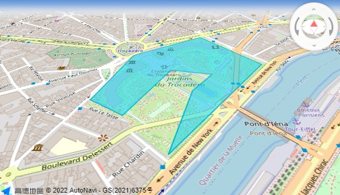
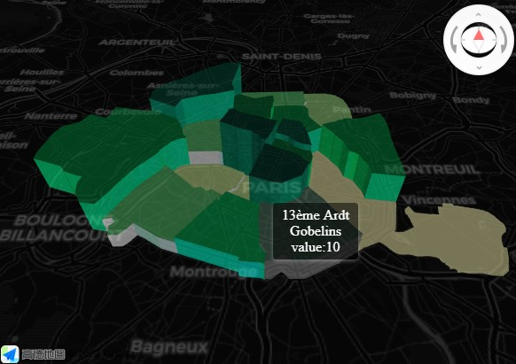

A collection of examples with source code (under ► Details)

### Amap geojson
Map with a simple geojson code displayed.
See [Geojson](https://a.amap.com/jsapi/static/doc/index.html#geojson) in Amap documentation.




```{r}
if (interactive()) {
glnglat <- list(c(2.290412,48.863673),c(2.292779,48.862115),c(2.288930,48.859023),c(2.289799,48.860950),c(2.290633,48.861634),c(2.289015,48.861835),c(2.287414,48.860088),c(2.286171,48.860614),c(2.287397,48.862586))
gjson <- list(type= "FeatureCollection", features= list(
  list(type= "Feature", properties= list(id="44", name="Trocadero"), 
       geometry= list(type= "Polygon", coordinates= as.matrix(list(glnglat)))
  )))
tile2 <- 'https://{a,b,c}.tile.openstreetmap.org/[z]/[x]/[y].png'

library(amapro)
am.init(
  loca= TRUE, viewMode= '3D',
  center= c(2.288930,48.859023), zoom= 16, pitch= 50) |>
  am.control('ControlBar', position= 'RT') |> 
  am.item('TileLayer', name='tileLay', tileUrl= tile2, zooms= c(3, 20) ) |>
  am.item('GeoJSON', name= 'mygjson', geoJSON= gjson)

}
```
 

### Loca PolygonLayer
Interactive 3D polygons on map, data from external _geojson_ file.
With colors by value, lighting and tooltips.  
See [PolygonLayer](https://a.amap.com/Loca/static/loca-v2/doc/html/index.html#polygonlayer) in Loca documentation.  
  



```{r}
tile4 <- 'https://{a,b,c,d}.basemaps.cartocdn.com/dark_all/[z]/[x]/[y].png'

# https://writingjavascript.com/scaling-values-between-two-ranges
jscala <- "window.scaler = class Scaler {
    constructor(inMin, inMax, outMin, outMax) {
      this.inMin = inMin;
      this.inMax = inMax;
      this.outMin = outMin;
      this.outMax = outMax;
    }
    scale(value) {
      const result = (value - this.inMin) * (this.outMax - this.outMin) / (this.inMax - this.inMin) + this.outMin;
      if (result < this.outMin) {
        return this.outMin;
      } else if (result > this.outMax) {
        return this.outMax;
      }
      return result;
    }
  }; 
  window.m$colors = ['#FFF8B4', '#D3F299', '#9FE084', '#5ACA70', '#00AF53', '#00873A', '#006B31', '#004835', '#003829'].reverse();
  "
pageo <- jsonlite::read_json('https://opendata.paris.fr/explore/dataset/arrondissements/download/?format=geojson&lang=fr')
for(i in 1:20) pageo$features[[i]]$properties$h <- i
onEvents <- list(
  list(e= 'click', f="function() {
            m$poly.addAnimate({
              key: 'height', value: [0, 1], duration: 1000, easing: 'CubicInOut'
            }, function() { });  
          }"),
  list(e= 'mousemove', f="function(e) {
    var feat = m$poly.queryFeature(e.pixel.toArray());
    if (feat) {
      m$txt.show();
      var health = feat.properties.h;
      m$txt.setText(feat.properties.l_ar + '<br>' + feat.properties.l_aroff + '<br> value:' + health);
      m$txt.setPosition(e.lnglat);
      m$poly.setStyle({
  topColor: (i, f) => { if (f===feat) return [164, 241, 199, 0.5];
        m$sc= new scaler(1,20,0,8); return m$colors[Math.round(m$sc.scale(f.properties.h))]; },
  sideTopColor: (i, f) => { if (f===feat) return [164, 241, 199, 0.5];
        m$sc= new scaler(1,20,0,8); return m$colors[Math.round(m$sc.scale(f.properties.h))]; },
  sideBottomColor: (i, f) => { if (f===feat) return [164, 241, 199, 0.5];
        m$sc= new scaler(1,20,0,8); return m$colors[Math.round(m$sc.scale(f.properties.h))]; },
  height: (i, f) => { m$sc= new scaler(1,18,0,4000); return 4000-m$sc.scale(f.properties.h); }
              })
      } 
      else
        m$txt.hide();
    }")
)

if (interactive()) {
library(amapro)
am.init(loca= TRUE,
     viewMode= '3D', pitch= 40, showLabel= TRUE, showBuildingBlock= FALSE,
     on= onEvents,
     mapStyle= 'amap://styles/dark', 
     zoom= 11, center= c(2.328007,48.86992) ) |>  #Paris
  am.control('ControlBar', position= 'RT') |> 
  am.item('TileLayer', name='tileLay', tileUrl= tile4, zooms= c(3, 20) ) |>
  am.item('GeoJSONSource', name= 'm$gjson', data=pageo) |>
  am.item('Text', name= 'm$txt', text= 'markup', anchor= 'center', 
          draggable= TRUE, cursor= 'pointer', angle= 0, visible= TRUE, offset= c(0, -40)
          ,style= list(
              padding= '5px 10px', `margin-bottom`= '1rem', `border-radius`= '.25rem',
             `background-color`= 'rgba(0,0,0,0.5)', `border-width`= 0,
             `box-shadow`= '0 2px 6px 0 rgba(255, 255, 255, .3)',
             `text-align`= 'center', `font-size`= '16px', color= '#fff')
  ) |>
  am.cmd('set','PolygonLayer', name='m$poly', opacity=0.5) |> 
  am.cmd('setSource', 'm$poly', 'm$gjson') |>
  am.cmd('code', jscala) |>
  am.cmd('setStyle', 'm$poly',
         altitude= 0,
         topColor= "function(i, f) { m$sc= new scaler(1,20,0,8); return m$colors[Math.round(m$sc.scale(f.properties.h))]; }", 
         sideTopColor= "function(i, f) { m$sc= new scaler(1,20,0,8); return m$colors[Math.round(m$sc.scale(f.properties.h))]; }",
         sideBottomColor= "function(i, f) { m$sc= new scaler(1,20,0,8); return m$colors[Math.round(m$sc.scale(f.properties.h))]; }",
         height= "function(i, f) { m$sc= new scaler(1,18,0,4000); return 4000-m$sc.scale(f.properties.h); }") |>
         
  am.cmd('set','ambLight', intensity= 0.9, color= '#fff') |>
  am.cmd('set','dirLight', intensity= 1, color= '#fff', position= c(1,-1, 0), target= c(0,0,0))
  
  # am.cmd('set','pointLight', color= 'rgb(100,100,100)',  position= c(2.328007,46.86992, 2000),
  #       intensity= 3, distance= 50000)

}
```

&nbsp;

More to come...

```{js, echo=FALSE}
(function() {
//  var codes = document.querySelectorAll('pre:not([class])');
  var codes = document.querySelectorAll('pre');
  var code, i, d, s, p;
  for (i = 0; i < codes.length; i++) {
    code = codes[i];
    p = code.parentNode;
    d = document.createElement('details');
    s = document.createElement('summary');
    s.innerText = 'Details';
    // <details><summary>Details</summary></details>
    d.appendChild(s);
    // move the code into <details>
    p.replaceChild(d, code);
    d.appendChild(code);
  }
})();
```
